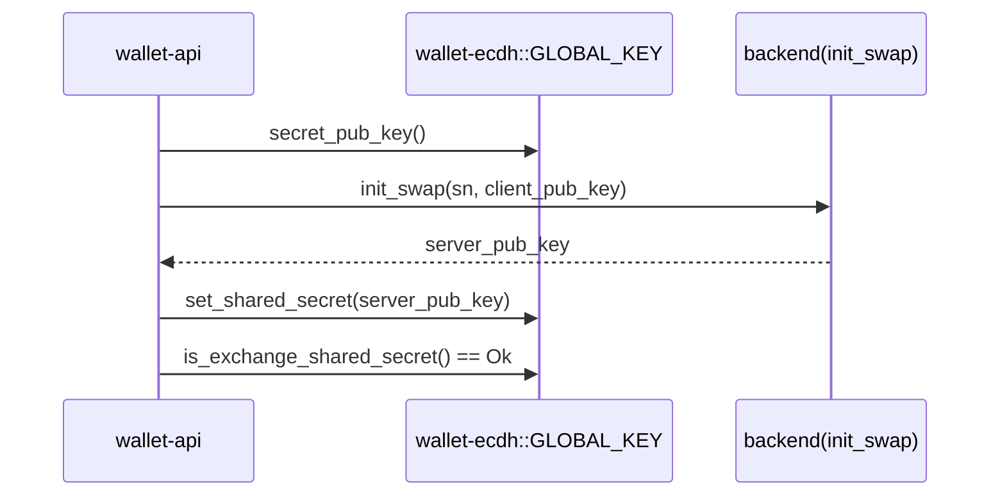
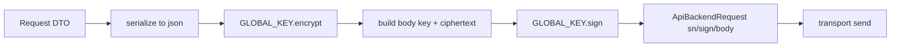
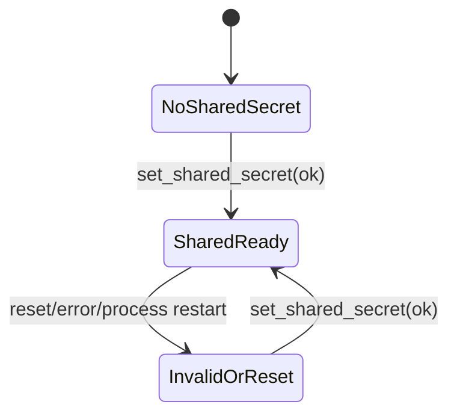

# ECDH 与 Backend 集成说明

## Purpose

本文描述的是当前工程里的集成实现：`wallet-ecdh` 如何为 `wallet-api` + `wallet-transport-backend` 提供会话态密钥交换、请求加密签名、响应验签解密。  
这不是协议设计提案，也不讨论“理想密码学重构”。

## Core Components

- `wallet-ecdh::GLOBAL_KEY`  
  进程级会话状态入口，保存 `sn` 与 `shared_secret`。调用方需要先完成握手，后续 API 才能加密与验签。
- `wallet-ecdh::ExKey`  
  提供 `secret_pub_key / set_shared_secret / is_exchange_shared_secret / encrypt / sign / verify / decrypt`。
- `wallet-transport-backend::api_request::ApiBackendRequest`  
  请求出站封装：`serialize -> encrypt -> sign`，并携带 `sn`。
- `wallet-transport-backend::response::api_response::ApiBackendResponse`  
  响应入站处理：`verify -> decrypt -> deserialize`。

## End-to-End Flow

### 1) 握手阶段（wallet-api 发起）

真实调用点：

- `wallet-api/src/service/api_wallet/wallet.rs`
  - `GLOBAL_KEY.secret_pub_key()` 生成客户端公钥
  - 调后端 `init_swap`
  - 使用返回 `pub_key` 执行 `GLOBAL_KEY.set_shared_secret(...)`



### 2) 请求出站（transport backend）

真实调用点：

- `wallet-transport-backend/src/api_request.rs`
  - `GLOBAL_KEY.encrypt(req_json_bytes)`
  - `GLOBAL_KEY.sign(tag, key+ciphertext)`
  - `sn = GLOBAL_KEY.sn()`



### 3) 响应入站（transport backend）

真实调用点：

- `wallet-transport-backend/src/response/api_response.rs`
  - `GLOBAL_KEY.verify(tag, key+data, sign)`
  - `GLOBAL_KEY.decrypt(data, key)`
  - `serde_from_slice(...)`


## State Model

`GLOBAL_KEY` 是进程级状态，核心字段是：

- `sn`：由上层在启动/初始化阶段写入（例如 manager 初始化）
- `shared_secret`：在 `init_swap` 成功后写入，后续所有加密签名依赖它

读取方：

- `wallet-transport-backend` 请求封装与响应解包
- 各 API 方法前置检查 `GLOBAL_KEY.is_exchange_shared_secret()`



## Failure Modes

- 未握手：`is_exchange_shared_secret()` 返回 `InvalidSharedKey`，API 调用前置失败。
- 请求签名失败：`GLOBAL_KEY.sign(...)` 返回签名相关错误。
- 响应验签失败：`GLOBAL_KEY.verify(...)` 返回 `InvalidSignature` 或签名校验错误。
- 响应解密失败：`GLOBAL_KEY.decrypt(...)` 返回解密失败错误。
- 全局状态污染：并发测试或跨用例共享 `GLOBAL_KEY` 导致状态串扰（已在 `wallet-ecdh` 提供 test-only reset 辅助）。

## Testing & Validation

建议离线最小验证：

```bash
cargo test -p wallet-ecdh
cargo test -p wallet-transport-backend --lib
```

验收重点：

- 握手成功后，出站请求可完成 `encrypt + sign`
- 入站响应可完成 `verify + decrypt`
- 未握手路径会被 `InvalidSharedKey` 拦截
